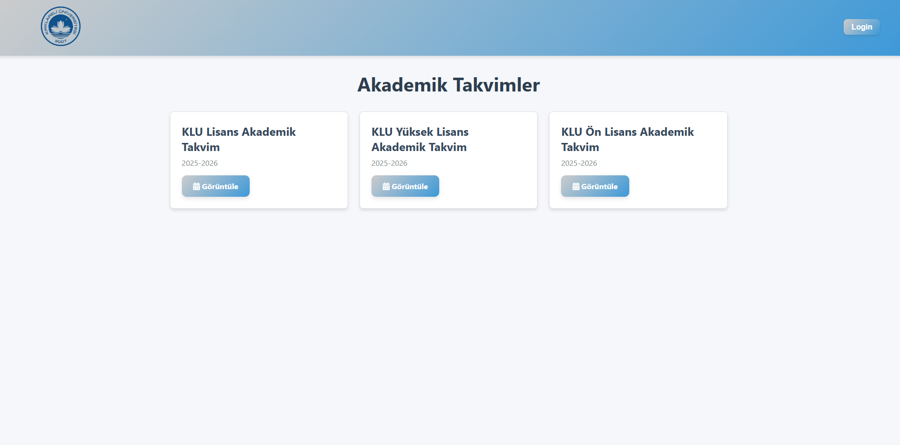
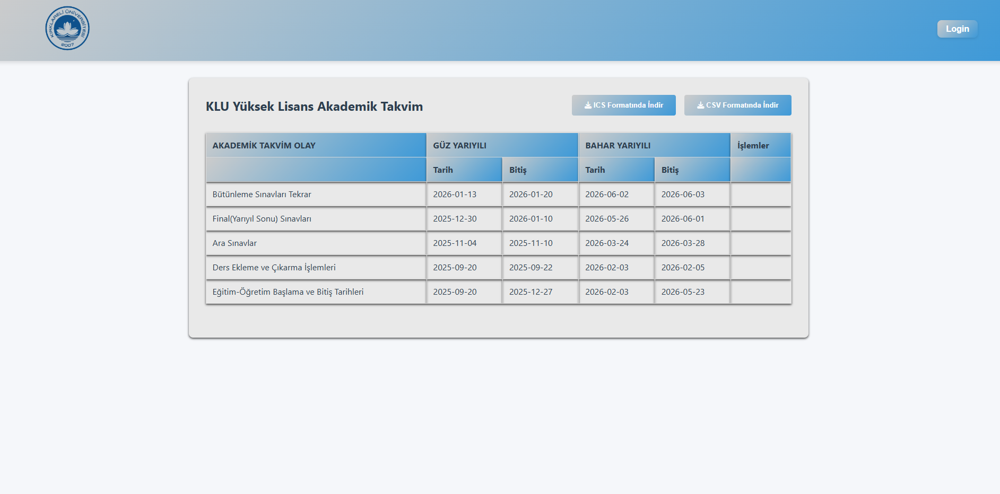
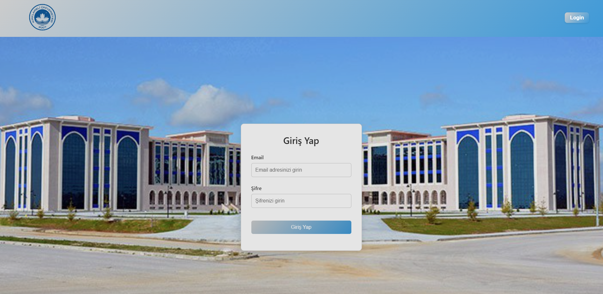
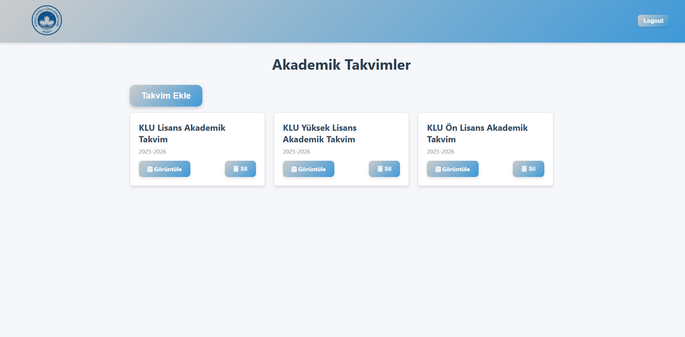
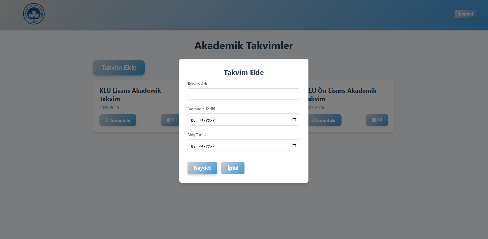
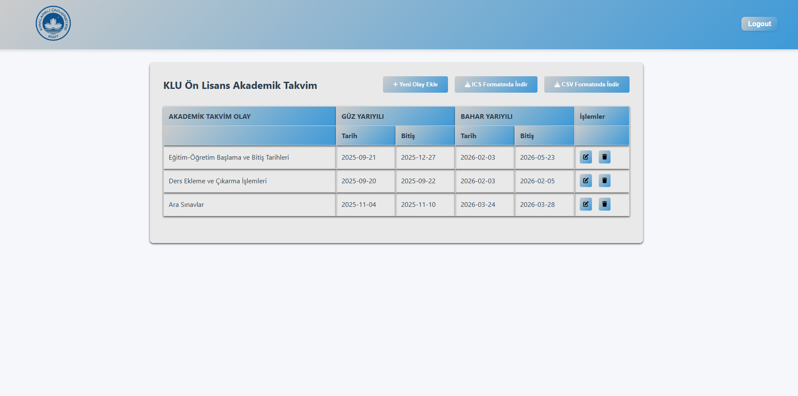
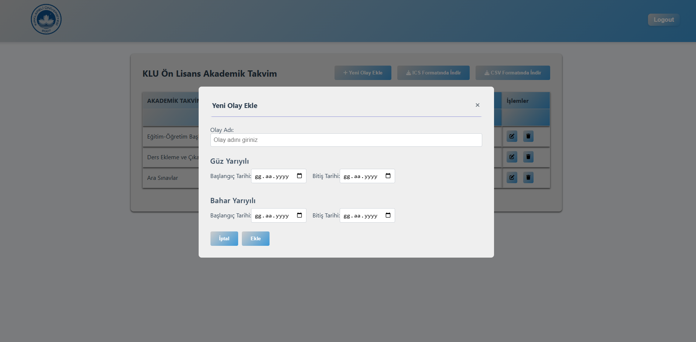
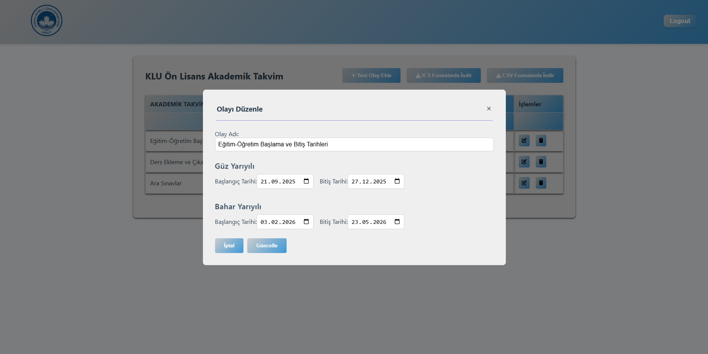
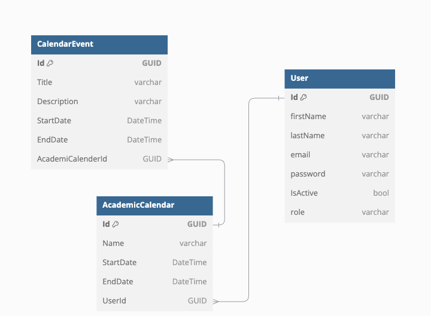

# AcademicCalendar



























## Özellikler

- Admin giriş ve çıkışı
- Akademik takvim yönetimi
- Modern ve kullanıcı dostu arayüz

## Kurulum

1. Bu projeyi klonlayın:

   ```bash
   git clone https://github.com/yelizozkan/AcademicCalendar.git
   ```

2. Gerekli bağımlılıkları yükleyin:

   ```bash
   npm install
   ```

3. Uygulamayı başlatın:

   ```bash
   npm run dev
   ```


